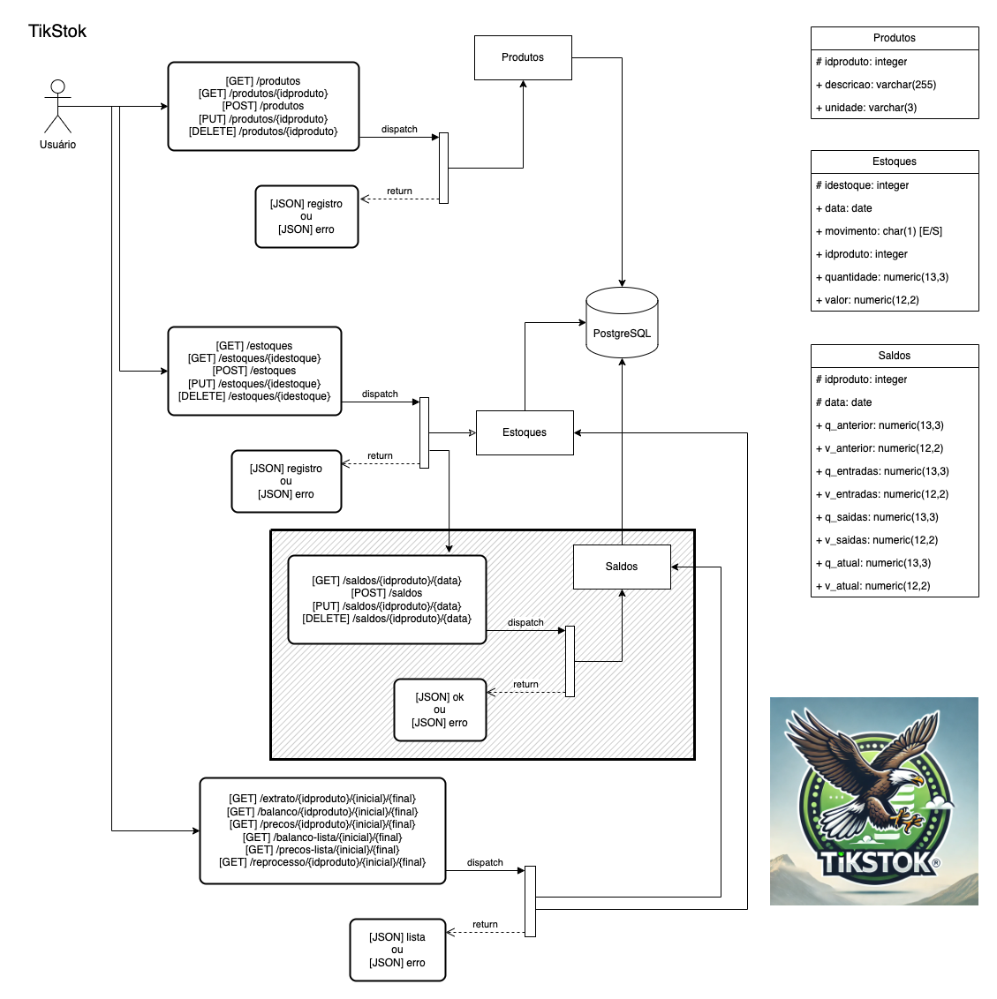

# TikStok


## Índice

- [Descrição do Projeto](#descrição-do-projeto)
- [Status do Projeto](#status-do-projeto)
- [Funcionalidades](#funcionalidades)
- [Pré-requisitos](#pré-requisitos)
- [Instalação](#instalação)
- [Execução](#execução)
- [Tecnologias Utilizadas](#tecnologias-utilizadas)
- [Contribuidores](#contribuidores)
- [Licença](#licença)

## Descrição do Projeto

O TikStok é uma API desenvolvida em Java utilizando o framework Spring Boot. Este projeto tem como objetivo fornecer funcionalidades relacionadas a micro serviços para:
- Cadastro de Produtos (api-produtos)
- Lançamentos de movimento de Estoques (api-estoques)
- Controle dos Saldos dos Produtos (api-saldos)
- Relatórios (api-relatorios):
    - Extratos (Movimentação dos Produtos)
    - Balanços (Saldos dos Produtos por Data)
    - Preços (Históricos dos preços de custo e preço de venda dos Produtos)
    - Resumo dos Balanços (Movimentação Total de todos os produtos num determinado período)
    - Resumo dos Preços (Lista dos preços de todos os produtos num determinado período)

## Status do Projeto


## Funcionalidades

- [x] Cadastro de produtos
- [x] Lançamento de estoques
- [ ] Saldos de produtos
- [ ] Saldos de produtos
- [ ] Extratos (Movimentação dos Produtos)
- [ ] Balanços (Saldos dos Produtos por Data)
- [ ] Preços (Históricos dos preços de custo e preço de venda dos Produtos)
- [ ] Resumo dos Balanços (Movimentação Total de todos os produtos num determinado período)
- [ ] Resumo dos Preços (Lista dos preços de todos os produtos num determinado período)
- [ ] Reprocessamento dos Saldos

## Pré-requisitos

Antes de iniciar, certifique-se de que você atendeu aos seguintes requisitos:

- Java JDK 17 ou superior instalado
- Maven instalado
- Banco de dados PostgreSQL configurado

## Instalação

1. Clone o repositório:

   ```bash
   git clone https://github.com/ibanez-junior-utfpr/TikStok.git

2. Navegue até o diretório do projeto:
   ```bash
   cd TikStok

3. Compile o projeto usando o Maven:
   ```bash
   mvn clean install

## Execução

1. Certifique-se de que o banco de dados PostgreSQL esteja em execução.

2. Execute a aplicação:
   ```bash
   mvn spring-boot:run

3. A API estará disponível em http://localhost:8080


## Tecnologias Utilizadas

- Java 11
- Spring Boot
- Maven
- PostgreSQL


## Contribuidores

- Guilherme Pissaia
- Adriana Sarturi
- Ibanez Fernandes


## Licença

Este projeto está licenciado sob a Licença MIT. Consulte o arquivo LICENSE para obter mais informações.


# Outras coisas do TikStok
Projeto de API usando Spring Boot (Java)

## Nova Logomarca

Experimental (ainda...)

## Diagrama

Para apresentação
